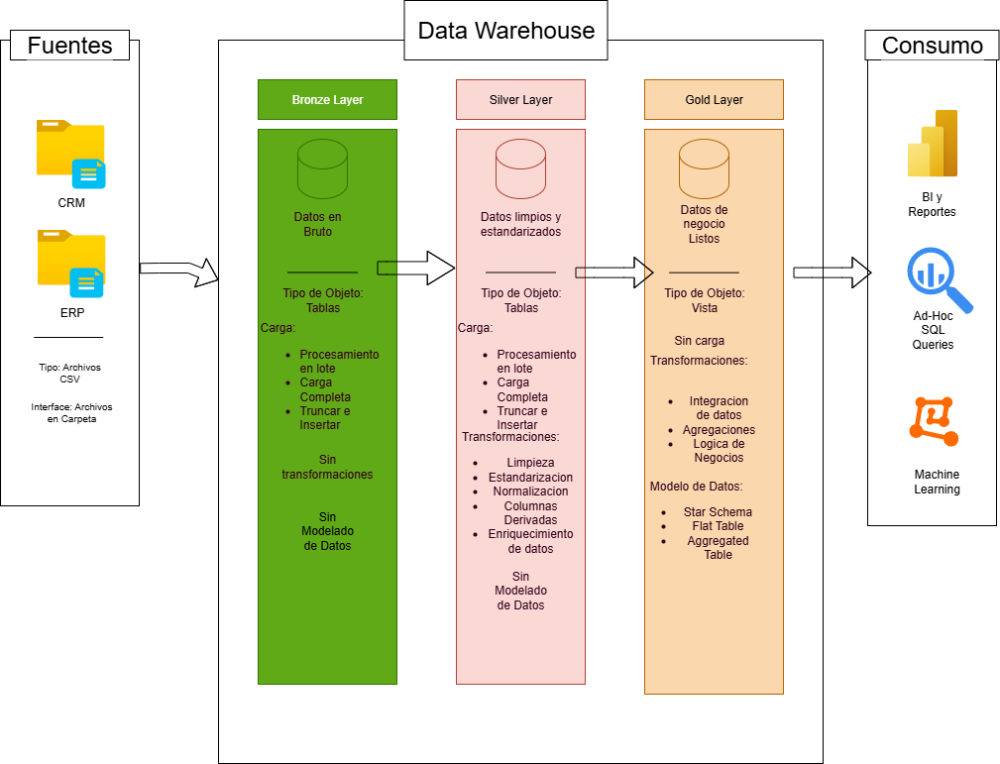

# Projecto_DataWareHouse

Este proyecto muestra una solución integral de almacenamiento y análisis de datos, desde la creación de un almacén de datos hasta la generación de información práctica. Diseñado como portafolio, pone las mejores prácticas del sector en ingeniería de datos y análisis.

## 🏗️ Arquitectura de Datos
La arquitectura de este proyecto es la de Medallion Architecture siguiendo las **Bronze**, **Silver**, y **Gold** layers:

1. **Bronze Layer**: Almacena los datos en su forma original tal como provienen de los sistemas fuente. Los datos se ingieren desde archivos CSV hacia una base de datos SQL Server.
2. **Silver Layer**: Esta capa incluye procesos de limpieza, estandarización y normalización de datos para prepararlos para el análisis.
3. **Gold Layer**: Contiene los datos listos para negocio, modelados en un esquema en estrella, necesarios para reportes y análisis.

---
## 📖 **Resumen del Proyecto**  
Este proyecto incluye:

- **Arquitectura de Datos:** Diseño de un Data Warehouse moderno utilizando la Arquitectura Medallion con capas Bronze, Silver y Gold.  
- **Pipelines ETL:** Extracción, transformación y carga de datos desde los sistemas fuente hacia el data warehouse.  
- **Modelado de Datos:** Desarrollo de tablas de hechos y dimensiones optimizadas para consultas analíticas.  
- **Analítica y Reportes:** Creación de reportes y dashboards basados en SQL para obtener insights accionables.  

🎯 Este repositorio es un recurso excelente para profesionales y estudiantes que desean demostrar experiencia en:

- Desarrollo SQL  
- Arquitectura de Datos  
- Ingeniería de Datos  
- Desarrollo de Pipelines ETL  
- Modelado de Datos  
- Análisis de Datos  

# 🚀 Requisitos del Proyecto

## Construcción del Data Warehouse (Ingeniería de Datos)

### Objetivo
Desarrollar un data warehouse moderno utilizando **SQL Server** para consolidar datos de ventas, habilitando reportes analíticos y la toma de decisiones informada.

### Especificaciones
- **Fuentes de datos:** Importar datos desde dos sistemas fuente (ERP y CRM) proporcionados como archivos CSV.  
- **Calidad de datos:** Depurar y resolver problemas de calidad de datos antes del análisis.  
- **Integración:** Combinar ambas fuentes en un único modelo de datos amigable para el usuario, diseñado para consultas analíticas.  
- **Alcance:** Centrarse únicamente en el conjunto de datos más reciente; no se requiere historización de datos.  
- **Documentación:** Proveer documentación clara del modelo de datos para apoyar tanto a las partes interesadas del negocio como a los equipos de analítica.

## BI: Analítica & Reportes (Análisis de Datos)

### Objetivo
Desarrollar analíticas basadas en **SQL** para entregar insights detallados sobre:

- **Comportamiento del cliente**  
- **Rendimiento del producto**  
- **Tendencias de ventas**

Estas métricas permiten a los stakeholders disponer de indicadores clave para la toma de decisiones estratégicas.
